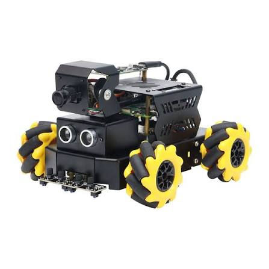

# estudart-raspbot2-distance-awareness

<p align="center">
  
</p>

A ROS2-based autonomous robot that uses ultrasonic sensors to detect obstacles and react in real time — moving backwards and flashing red when something is too close, and cruising forward with a blue light when the path is clear.

Built on a Raspberry Pi with ROS2. First personal robotics project. Still a work in progress!

## How it works

The robot runs a ROS2 node (`UltrasonicProcessor`) that subscribes to distance readings from an ultrasonic sensor and publishes movement and LED commands based on proximity thresholds:

| Distance | Behavior | LED |
|----------|----------|-----|
| < 20 cm | Move backward | Red |
| > 40 cm | Move forward | Blue |

## Architecture

```
/ultrasonic (Float32)
        |
        v
UltrasonicProcessor
        |
        |---> /cmd_vel (Twist)       # movement commands
        |---> /rgblight (Int32MultiArray)  # LED color
```

## Topics

| Topic | Type | Direction |
|-------|------|-----------|
| `/ultrasonic` | `std_msgs/Float32` | Subscribe |
| `/cmd_vel` | `geometry_msgs/Twist` | Publish |
| `/rgblight` | `std_msgs/Int32MultiArray` | Publish |

## Stack

- Raspberry Pi
- ROS2
- Python
- Ultrasonic distance sensor
- RGB LED

## Running

```bash
ros2 run raspbot2 distance_awareness
```

## Repo structure

```
src/
  services/
    distance_awareness.py   # main ROS2 node
```
